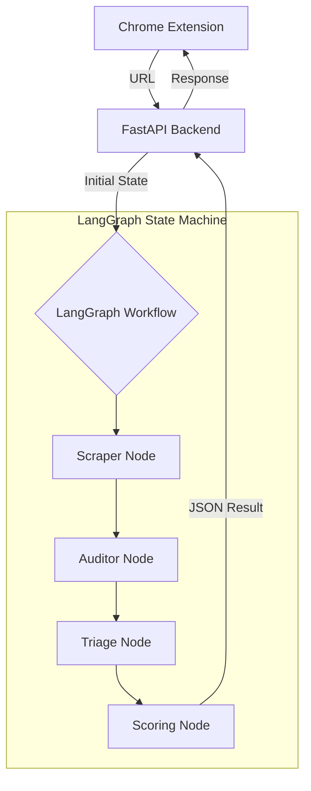

# 🛡️ T&C Guardian: AI-Powered Legal Shield

[](https://fastapi.tiangolo.com/)
[](https://github.com/langchain-ai/langgraph)
[](https://groq.com/)
[](https://developer.chrome.com/docs/extensions)

**T&C Guardian** is a sophisticated AI-driven tool designed to demystify complex "Terms and Conditions" documents. Using state-of-the-art LLMs and agentic workflows, it scans legal pages in real-time, identifies hidden risks, and provides a clear safety grade—all within your browser.

---

##  The Problem
Most users skip Terms & Conditions because they are long, complex, and filled with "legalese." This often leads to unknowingly agreeing to invasive data sharing, hidden fees, or unfair arbitration clauses. **T&C Guardian** acts as your personal legal advisor, highlighting what *actually* matters before you click "Agree."

##  Key Features
- **One-Click Analysis:** Scan any website's T&C page directly from the extension.
- **Agentic AI Pipeline:** Powered by **LangGraph**, it handles scraping and analysis with deterministic reliability.
- **Risk Scoring:** Get an instant safety score (0-100) and a letter grade (A-F).
- **Categorized Findings:** Risky clauses are grouped into **Privacy**, **Financial**, **Legal**, and **Data Rights**.
- **Real-Time Summaries:** Concise explanations of complex legal jargon.

---

##  Technical Architecture: Linear vs. Agentic

T&C Guardian is built using a production-ready **Agentic RAG** stack. Unlike standard "wrapper" extensions that simply pass text to an LLM, this project implements a state-of-the-art orchestration layer.

###  Architectural Comparison

| Component | Standard AI Extension  | T&C Guardian  |
| :--- | :--- | :--- |
| **Orchestration** | **Linear/Sequential:** A single request-response loop to the LLM. | **Agentic (LangGraph):** Iterative loops where agents evaluate, critique, and refine findings. |
| **Data Retrieval** | **Context Window Stuffing:** Sends whole page text at once, hitting token limits. | **RAG Pipeline:** Intelligently fetches and transforms specific sections (XML/Markdown). |
| **Processing** | **Black Box:** Processing happens on proprietary servers (data may be logged). | **Local/BYO-Key:** Processing logic is transparent; users provide their own keys. |
| **Output Logic** | **Generative Summary:** Produces a general "vibe" of the terms. | **Deterministic Triage:** Maps findings to specific risk categories with a weighted Safety Score. |

---

##  The Agentic RAG Workflow

The system moves beyond the "Wrapper Model" (Scrape -> Send -> Summarize) and instead employs a robust, multi-stage pipeline designed for high-stakes auditing.

### 1. Ingestion & Transformation
The system fetches legal text (ToS, Privacy Policies) and transforms it into a structured format like Markdown with YAML frontmatter. This preserves the document hierarchy and ensures that the AI understands the context of specific headers and clauses.

### 2. LangGraph Orchestration
Instead of a single prompt, the system enters a graph-based state machine where specialized agents collaborate:

-  **The Auditor Agent:** Scans the structured text for specific "Harmful Clauses" (Liability, Data Usage, Arbitration, etc.).
- **The Triage Agent:** Categorizes the severity of each flag found (Critical, High, Medium).
- **The Scoring Agent:** Calculates a final **Safety Score** based on the density and severity of the identified risks.



### 3. RAG-Enhanced Grounding
Every flagged clause is grounded in the actual document text using a semantic retriever. This ensures the audit is based on verifiable evidence rather than LLM hallucinations. If a clause is flagged, the system points to the exact paragraph that triggered the warning.

### 4. Local Sovereignty (BYO-Key)
Because the "brain" of the project is transparent and runs using your own API credentials, your legal audits remain private. You own the logs, you own the keys, and you own the data.

---

##  Built With

| Component | Technology |
| :--- | :--- |
| **Backend** | FastAPI (Python) |
| **Orchestration** | LangGraph (Stateful Agents) |
| **LLM** | Groq (Llama 3.3 70B) |
| **Scraping** | Crawl4AI / BeautifulSoup |
| **Frontend** | Chrome Extension (Manifest V3, Vanilla JS/CSS) |

---

##  Installation & Setup

### Prerequisites
- Python 3.10+
- A [Groq API Key](https://console.groq.com/keys)
- Google Chrome (or any Chromium-based browser)

### 1. Clone the Repository
```bash
git clone https://github.com/your-username/t-c-guardian.git
cd t-c-guardian
```

### 2. Backend Setup
1. **Create a virtual environment:**
   ```bash
   python -m venv .venv
   source .venv/bin/activate  # On Linux/macOS
   .venv\Scripts\activate     # On Windows
   ```
2. **Install dependencies:**
   ```bash
   pip install -r requirements.txt
   ```
3. **Configure Environment Variables:**
   Create a `.env` file in the root directory:
   ```env
   GROQ_API_KEY=your_groq_api_key_here
   ```
4. **Run the server:**
   ```bash
   uvicorn backend.main:app --reload
   ```
   The backend will be available at `http://localhost:8000`. You can visit `/docs` for the interactive API documentation.

### 3. Extension Setup
1. Open Chrome and navigate to `chrome://extensions/`.
2. Enable **"Developer mode"** (toggle in the top right).
3. Click **"Load unpacked"**.
4. Select the `extension` folder from the root of this project.
5. Pin the **T&C Guardian** icon to your toolbar for easy access.

---

##  Usage
1. Navigate to any website's Terms of Service (e.g., [Google Terms](https://www.google.com/policies/terms/)).
2. Click the **T&C Guardian** extension icon.
3. Click **"Scan This Page"**.
4. Wait a few seconds for the AI to analyze the content and present the findings.

---

##  Contributing
Contributions are welcome! Please feel free to submit a Pull Request.
1. Fork the Project
2. Create your Feature Branch (`git checkout -b feature/AmazingFeature`)
3. Commit your Changes (`git commit -m 'Add some AmazingFeature'`)
4. Push to the Branch (`git push origin feature/AmazingFeature`)
5. Open a Pull Request

##  License
Distributed under the Apache License. See `LICENSE` for more information.

---
<p align="center">
  Built with consideration for a safer internet.
</p>
